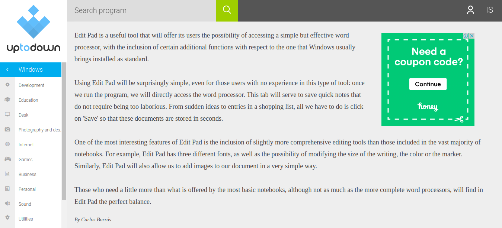

# Editpad

 <h2>A basic word processor application for Windows computers.</h2>
 
 

<h4>Download Links</h4>

1. <a href="https://editpad.github.io/" target="_blank"> Website </a> 

2. <a href="https://download.cnet.com/Edit-Pad/3000-2351_4-78238145.html" target="_blank"> download.cnet.com </a>

3. <a href="https://edit-pad.soft32.com/" target="_blank"> soft32.com </a>

4. <a href="https://edit-pad.uptodown.com/windows" target="_blank"> uptodown.com </a>

